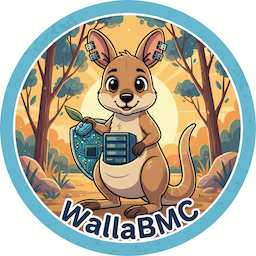

# WallaBMC

## Overview

WallaBMC is a simple, lightweight Baseboard Management Controller (BMC) firmware suitable for STM32 and similar class microcontrollers. Built on the Zephyr RTOS, WallaBMC provides essential BMC functionality including network management, host power control, and web-based administration through a Redfish-compliant interface.

WallaBMC is designed for embedded systems requiring BMC capabilities without the complexity of full-featured BMC solutions. It provides core functionality for monitoring and managing host systems through industry-standard interfaces.

### Features

* **LED Status Indicators**: Visual feedback for system status
* **IPv4 Networking**: Static IP or DHCP with mDNS hostname resolution
* **Redfish Interface**: Industry-standard RESTful API for management
* **Web Interface**: HTTP/HTTPS web UI for administration
* **BMC Console**: Management console accessible via serial or web interface
* **Persistent Configuration**: Settings stored across reboots
* **Host Power Control**: Power on/off management for host systems
* **Host Console**: Serial console access (coming soon)

### Hardware Support

WallaBMC currently supports the following hardware platforms:

| Hardware | |
| --- | --- |
| **SiFive HiFive Premier P550 MCU** | RISC-V based platform |
| **STM32 Nucleo F767ZI** | ARM Cortex-M7 development board (standalone, no host CPU) |
| **qemu** | see [run_qemu_ci.py](scripts/run_qemu_ci.py) |

## Using

### Prerequisites

Before getting started, ensure you have a proper Zephyr development environment. Follow the official [Zephyr Getting Started Guide](https://docs.zephyrproject.org/latest/getting_started/index.html).

Required tools:

* West (Zephyr's meta-tool)
* CMake (version 3.20.0 or later)
* Python 3
* A toolchain for your target platform (ARM or RISC-V)
* OpenOCD or appropriate flashing tool for your hardware

### Installation

#### Initialize Workspace

The first step is to initialize the workspace folder where WallaBMC and all Zephyr modules will be cloned:

```
# Initialize workspace for WallaBMC (main branch)
west init -m https://github.com/tenstorrent/wallabmc.git --mr main workspace
# update Zephyr modules
cd workspace
west update
```

#### Building

To build the application, run the following command:

```
cd wallabmc
west build -b $BOARD app
```
where $BOARD is the target board.

### Supported boards:

See the [Hardware Support](#Hardware Support) section.

### Flashing

```
west flash --runner openocd
```

Alternatively, use the ``zephyr.elf`` file from the ``build/zephyr`` directory
and run the openocd command:

```
flash write_image erase zephyr.elf
```

### Running

When the system has booted, a slow-blinking status LED indicates the system
is running.

The Nucleo exposes an STM32 UART as a serial device over the USB port.
WallaBMC puts the BMC console on this serial device that displays boot
and log messages, and can be used to query and configure the device.

WallaBMC supports networking over ethernet and by default uses DHCP with the
hostname ``wallabmc`` to get an IP address.

WallaBMC opens an HTTP (and possibly HTTPS) port, which provides Redfish and
Web UI. The Web UI can also access the BMC console.

### Settings and configuration

* ``help`` command listing with hierarchical help (e.g., ``help config``).
* ``config`` shell command can be used to configure the BMC.
* ``power`` can power the host on and off. On the Nucleo board there is no
  host CPU so one of the LEDs is a stand-in for a host power GPIO.

## Contributing

See [CONTRIBUTING.md](CONTRIBUTING.md) for information on how to contribute to this project.

## License

This project is licensed under the terms described in:

* [LICENSE](LICENSE) – code license
* [LICENSE_understanding.txt](LICENSE_understanding.txt) – license summary and clarification
* [LICENSE-DOCS](LICENSE-DOCS) – Creative Commons license for all documentation and logos
